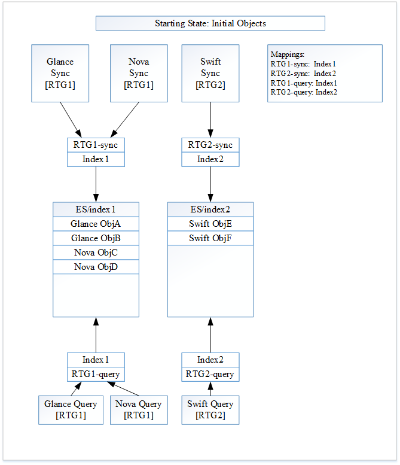
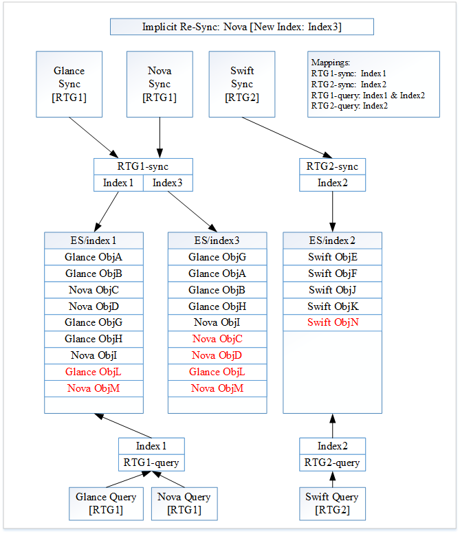
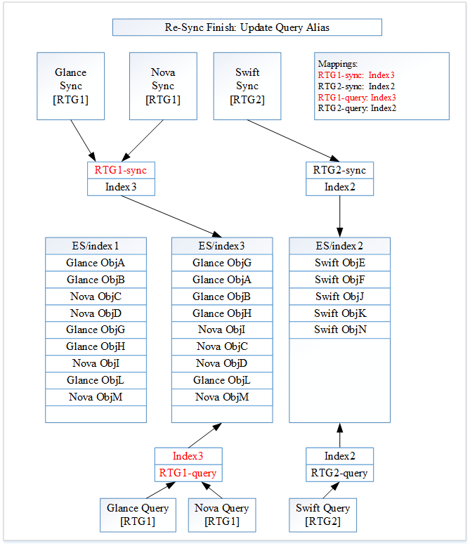

..
    c) Copyright 2015-2016 Hewlett-Packard Development Company, L.P.

    Licensed under the Apache License, Version 2.0 (the "License"); you may
    not use this file except in compliance with the License. You may obtain
    a copy of the License at

        http://www.apache.org/licenses/LICENSE-2.0

    Unless required by applicable law or agreed to in writing, software
    distributed under the License is distributed on an "AS IS" BASIS, WITHOUT
    WARRANTIES OR CONDITIONS OF ANY KIND, either express or implied. See the
    License for the specific language governing permissions and limitations
    under the License.

================================================
Zero Downtime Re-indexing
================================================

https://blueprints.launchpad.net/searchlight/+spec/zero-downtime-reindexing

This feature enables seamless zero downtime re-indexing of resource data from
an API user's point of view.

Problem Description
===================

As a user of the searchlight API, we expect the following traits:
 * The index is up to date and coherent with the source data
 * The index is available
 * That we are not affected by updates and upgrades to the searchlight service

As a deployer, we expect the following:
 * That we can roll out service upgrades and update the index with new data
 * That we can bring the index back into coherency without downtime
 * That we can tune the service deployment according to performance needs
 * That we can have easy deployment of new / patched plugins
 * That we can change data mappings and re-index the data

Background
----------

ElasticSearch documents are stored and indexed into an "index" (imagine that).
The index is a logical namespace which points to primary and replica shards
where the document is replicated. A shard is a single Apache Lucene instance.
The shards are distributed amongst nodes in a cluster. API users only interact
with the index and are not exposed to the internals, which ElasticSearch
manages based on configuration inputs from the administrator.

Certain actions can only be done at index creation time, such as changing
shard counts, changing the way data is indexed, etc. In addition to changing
the data, re-populating an index that has lost coherency with source service
data is much easier to do from scratch rather than determining what differences
there are in the data. Due to this the data and indexes should be designed so
that it is possible to re-index at any time without disruption to API users.
The re-indexing happens while the services are in use, still indexing new
documents in ElasticSearch.

In Searchlight 0.1.0, we allowed for each plugin to specify the index where
the data should be stored via configuration in the searchlight-api.conf file.
By default, all plugins store their data in the "searchlight" index. This was
simply chosen as a starting point, because the amount of total data indexed
for resource instance data is believed to be quite small in comparison to
typical log based indexing for small deployments, but this may differ
dramatically based on the resource type being indexed and the size of the
deployment.

To reiterate, all resource types in Searchlight 0.1.0 (either the plug-in or
the searches) have the ElasticSearch index hard-coded into them. This
hard-coded functionality prevents Searchlight from doing smart things
internally with ElasticSearch. Exposing indexes directly to the users is
generally not recommended by the user community or by ElasticSearch. Instead,
they recommend using aliases. API users can use an alias in exactly the same
way as an index, but it can be changed to point to different index(es)
transparently to the user. This allows for seamless migration between
indexes, allowing for all of the above use cases to be fulfilled.

The concept of aliases is described in depth in the ElasticSearch guides [1].

Proposed Change
===============

With this blueprint, we will divorce the plug-ins and searches from knowing
about physical ElasticSearch indexes. Instead we will introduce the concept
of a "Resource Type Group". A Resource Type Group is a collection of Resource
Types that are treated as a single unit within ElasticSearch. All users of
Searchlight will deal with Resource Type Groups, instead of low-level
ElasticSearch details like an index or alias. A Resource Type Group will
correspond to ElasticSearch aliases that are created and controlled by
Searchlight.

The plug-in configuration in the searchlight-api.conf file will no longer
specify the index name. Instead the plug-in will specify the Resource Type
Group it chooses to be a member of. It is important for a plug-in to know which
Resource Type Group it belongs. When some operations are undertaken by one
member of a Resource Type Group, it will need to be done to all members in
the group. There will be more details on this later.

Now that the users are removed from the internals of ElasticSearch, we
can handle zero downtime re-indexing. The basic idea is to create new
indexes on demand, populate them, but use ElasticSearch aliases inside of
Searchlight in a way that makes the actual indexes being used transparent
to both API users and Searchlight listener processes.

We will not directly expose the alias to API users. We will use resource
type mapping to transparently direct API requests to the correct alias.
When implementing this blueprint, we may choose to still expose an "index"
through the plug-in API. Exposing an "index" may allow other open-source
ElasticSearch libraries (which are index-based) to still work. Currently
we are not using any of these libraries, but we may not want to exclude
their usage in the future.

Searchlight will internally manage two aliases per Resource Type Group.
Note: Having these two aliases is the key change enabling zero downtime
indexing.

 * API alias
 * Listener/Sync alias

The names of the aliases will be derived from the Resource Type
Group name in the configuration file. Exactly how this is handled will
be left to the implementation. For example, we can append "-listener" and
/Sync"-search" to the Resource Group Type name for the two aliases.

The API alias will point to a single "live" index and only be switched once
the index is completely ready to serve data to the API users. Completely
ready means that the new index is a superset of the old index. This allows
for transparently switching the incoming requests to the new index without
disruption to the API end user.

The listener alias will point to 1...* indexes at a time. The listener
simply knows that it must perform CRUD operations on the provided alias. The
fact that it might be updating more than one index at a time is
transparent to the listener. The benefit to this is that the listeners do
not have to provide any additional management API as ElasticSearch handles
this for us automatically.

The algorithm for searchlight-manage index sync will be changed to the following:

 * Create a new index in ElasticSearch. Any mapping changes to the index are done
   now, before the index is used.
 * Add the new index to the listener(s) alias. At this point, the listener’s alias is
   pointing to multiple indexes. The new index is now "live" and receiving data. Any
   data received by the listener(s) will be sent to both indexes.

    * There is an issue with indexing an alias with multiple indexes [2]. The
      issue is that this case is not allowed! In this case we will catch the
      exception and write to both indexes individually in this step. For more
      details, refer to the "Implementation Notes" subsection below.
 * Bulk dump of data from each Resource Type associated with the old index to the
   new index in ElasticSearch.

    * The same issue with multiple indexes mentioned above applies here also.
 * Atomically switch the aliases for the API alias to point to the new index.
    * We will use the actions command with remove/add commands in the same actions API call.
      ElasticSearch treats this as an atomic operation. [2]::

      { "actions" : [ { "remove" : { ...} }, { "add" : " {...} } ] }

 * Remove the old index from the listener(s) alias.
 * Delete the old index from ElasticSearch. We do not want the index to hang around
   forever. We can figure out when the index is no longer being used and then delete
   it (asynchronous task, a type of internal reference count, etc). If this turns out
   to be too unwieldy we can revisit this action.

Notes:
 * This algorithm assumes that we can handle out of order events. See below for more details.
 * During the re-syncing process, the listener(s) will be adding any new documents to both indexes.
 * The listeners will always keep the ElasticSearch index associated with the API alias up to date.
 * The listeners will keep the old index up to date after the API alias has switched over to minimize any race conditions.

A critical aspect to all of this is that the batch indexer and all
notification handlers MUST only update documents if they have the most
recent data. This is being handled by a separate bug [3]. In addition,
Searchlight listeners and index must start setting the TTL field in deleted
documents instead of deleting them right away. This functionality is covered
in the ES deletion journal blueprint [4].

We are operating on a Resource Type Group as a whole. We need to make sure
that the entire Resource Type Group is re-indexed instead of just a single
Resource Type within the group. For example, consider the case where a
Resource Type Group consists of Glance and Nova. When Searchlight gets a
command to re-index Glance, Searchlight needs to also re-index Nova. Otherwise
the new index will not have the previous Nova objects in it. If Nova did not
re-index, the new index will not be a superset of the old index. When the
alias switches to this new index it will be incomplete.

The CLI must support manual searchlight-manage commands as well as automated
switchover. For example:

 * Delete the specified or current index / alias for a specific resource type group.
 * Create a new index for the specified resource type group.
 * Switch API and listener aliases automatically when complete (default - yes).
 * Delete old index automatically when complete (default - yes).
 * Provide a status command so that progress can be seen.
   * List all aliases and indexes by resource type with their status
   * Can be used from a GUI or a separate CLI concurrently to monitor progress.

This change affects:

 * The plugins API which lists plugins
 * The API
 * The Listener
 * The bulk indexer
 * The CLI

Illustrated Example
-------------------

To further illuminate the blueprint we will turn to a series of images and save
ourselves thousands of words. The images shows the state of Searchlight during
sequence of operations.

For this example we have three resource types: Glance, Nova and Swift. There are
two Resource Type Groups. The first group, RTG1, contains Glance and Nova. The
two aliases associated with RTG1 are "RTG1-sync" for the plug-in listeners and
"RTG1-query" for the plug-in searches. The second group, RTG2, contains Swift.
The two aliases associated with RTG2 are "RTG2-sync" for the plug-in listener
and "RTG2-query" for the plug-in search.

Figure 1: The initial State

First Searchlight will create the ElasticSearch index "Index1" for use by RTG1.
The ElasticSearch aliases "RTG1-sync" and "RTG1-query" are created and will both be
associated with the index "index1".  Next Searchlight will create the
ElasticSearch index "Index2" for use by RTG2. The ElasticSearch aliases
"RTG2-sync" and "RTG2-query" are created and will both be associated with the index
"Index2".

Glance has now created two documents "Glance ObjA" and "Glance ObjB". Nova has
created two documents "Nova ObjC" and "Nova ObjD". These four new documents for
the first Resource Type Group are now indexed. They will be indexed against
alias "RTG1-sync" and end up in index "Index1".

Swift has now created two new documents "Swift ObjE" and "Swift ObjF". These two
new documents for the second Resource Type Group are now indexed. They will be
indexed against alias "RTG2-sync" and end up in index "Index2".

Figure 1 shows the current state of Searchlight.

A Glance search will be made against "RTG1-query". Going to "Index1" it will return
"Glance ObjA", "Glance ObjB", "Nova ObjC" and "Nova ObjD". A Swift search will
be made against "RTG2-query". Going to "index2" it will return "Swift ObjE" and
"Swift ObjF".

Figure 2: Explicit Glance Re-sync

.. image:: ../../images/ZeroFig2.png

All of the changes from Image 1 are highlighted in red.

Searchlight receives a re-index command for Glance. After the re-sync, Glance
creates two new documents "Glance ObjG" and "Glance ObjH". Nova creates one new
document "Nova ObjI". Swift creates two new documents "Swift ObjJ" and "Swift
ObjK".

Searchlight will create a new ElasticSearch index "Index3". Since Glance is
re-syncing, the new index is associated with RTG1. Searchlight now associates
both "Index1" and "Index3" to the alias "RTG1-sync". Since the new index "Index3"
is not a superset of the index "Index1" yet, we do not change the RTG1 search
alias "RTG1-query". It remains unchanged for now.

As the Glance re-sync occurs, the previous Glance documents "Glance ObjA" and
"Glance ObjB" get indexed into "Index3". The new documents for RTG1 ("Glance
ObjG", "Glance ObjH" and "Nova ObjI") are indexed against the alias "RTG1-sync".
These documents end up in both "Index1" and "Index3".

The new documents for RTG2 ("Swift ObjJ" and "Swift ObjK") are indexed against
the alias "RTG2-sync". These documents end up in "Index2".

Figure 2 shows the current state of Searchlight.

A Glance search will be made against "RTG1-query". Going to "Index1" it will
return "Glance ObjA", "Glance ObjB", "Nova ObjC", "Nova ObjD", "Glance ObjG",
"Glance ObjH" and "Nova ObjI". A Swift search will be made against "RTG2-query".
Going to "index2" it will return "Swift ObjE", "Swift ObjF", "Swift ObjJ" and
"Swift ObjK".

This diagram shows the subtle point that all resource types within a Resource
Type Group need to re-synced together. If we did not re-sync Nova and updated
the RTG1 search alias "RTG1-query" to be associated with the new index "Index3", the
Searchlight state is incorrect. A Glance search will now be made against
"Index3" and it will return "Glance ObjA", "Glance ObjB", "Glance ObjG",
"Glance ObjH" and "Nova ObjI". This is incorrect as it does not include the
earlier Nova documents: "Nova ObjC" and "Nova ObjD". This incomplete state is
the reason that all resources in a Resource Type Group need to be re-synced
before the Resource Type Group re-sync is to be considered completed.

Figure 3: Implicit Nova Re-Sync

All of the changes from Image 2 are highlighted in red.

Searchlight starts an implicit Nova re-sync, since Nova is a member of RTG1.
All of the aliases are still set up correctly, so they do not need to change.
After the re-sync, Glance creates one new document "Glance ObjL". Nova creates
one new document "Nova ObjM". Swift creates one new documents "Swift ObjN".

As the Nova re-sync occurs, the previous Nova documents "Nova ObjC" and "Nova
ObjD" get indexed into "Index3". The new documents for RTG1 ("Glance ObjL" and
"Nova ObjM") are indexed against the alias "RTG1-sync". These documents end up in
both "Index1" and "Index3".

The new document for RTG2 ("Swift ObjN") is indexed against the alias "RTG2-sync".
This document ends up in "Index2".

Searchlight has not yet acknowledged the Nova re-sync as being completed.
Therefore "RTG1-query" has not been updated yet.

Figure 3 shows the current state of Searchlight.

A Glance search will be made against "RTG1-query". Going to "Index1" it will
return "Glance ObjA", "Glance ObjB", "Nova ObjC", "Nova ObjD", "Glance ObjG",
"Glance ObjH", "Nova ObjI", "Glance ObjL" and "Nova ObjM". A Swift search will
be made against "RTG2-query". Going to "index2" it will return "Swift ObjE",
"Swift ObjF", "Swift ObjJ", "Swift ObjK" and "Swift ObjN".

Figure 4: RTG1 Re-Sync Complete

All of the changes from Image 3 are highlighted in red.

All resource types within RTG1 have finished re-syncing. Searchlight will now
update the RTG1 search alias "RTG1-query". The alias "RTG1-query" will now be
associated with index "Index3". After updated the RTG1 search alias,
Searchlight will update the RTG1 plug-in listener alias "RTG1-sync". The alias
"RTG1-sync" will now be associated with the index "Index3".

The alias updates need to happen in this order to handle the corner case of a
new RTG1 document being indexed while the aliases are being modified. If we
modified the RTG1 plug-in listener alias first a new document would be indexed
to index "Index3" only. But a search will still go to index "Index1", thus
missing the newly indexed document.

Figure 4 shows the current state of Searchlight.

A Glance search will be made against "RTG1-query". Going to "Index3" it will
return "Glance ObjA", "Glance ObjB", "Nova ObjC", "Nova ObjD", "Glance ObjG",
"Glance ObjH", "Nova ObjI", "Glance ObjL" and "Nova ObjM". A Swift search will
be made against "RTG2-query". Going to "index2" it will return "Swift ObjE",
"Swift ObjF", "Swift ObjJ", "Swift ObjK" and "Swift ObjN".

The internal Searchlight state is correct, coherent and ready to continue.
Sometime in the future we will be able to delete Index1 completely.

Implementation Notes
--------------------

Implementation Note #1: Multiple Indexes
----------------------------------------

Upon careful review of the ES alias documentation [2], there is this warning
lurking in the shadows: "It is an error to index to an alias which points to
more than one index." Yikes. Now the simple solution of adding additional
indexes to an alias and having the re-indexing just work, will not work.
ElasticSearch will through an "ElasticsearchIllegalArgument" exception and
return a 400 (Bad Request).

The plug-ins will need to be aware of this exception and react to it.
Through experimentation, ElasticSearch will return this error: ::

    {"error":"ElasticsearchIllegalArgumentException[Alias [test-alias] has more than one indices associated with it [[test-2, test-1]], can't execute a single index op]","status":400}

From this error message, we have the actual indexes. After extracting
the names of the indexes, the plug-ins will be able to complete the
task. The plug-in will now index iterating on each real index, instead
of using the alias. This case applies only to the case where there are
multiple indexes in an alias (i.e. the re-syncing case). When not
re-syncing, the plug-in will not receive this exception.

We need to be careful when parsing the error message. This is a potential
hazardous area if the error message ever changes. The catching of the
exception and parsing of the message should be as flexible as possible.

Implementation Note #2: Incompatible Changes
--------------------------------------------

A corner case in the rationale for triggering a re-index needs to be
addressed. Sometimes an incompatible change between indexes has occurred.
For example a new plug-in has been added or the documents from the
service of changed in an incompatible way (different ElasticSearch mapping).
In any of these cases we need to be able to handle the changes and
roll them out seamlessly.

Some possible options to handle these cases would include:
 * Disable re-indexing into the old index.
 * Run two listeners, one understanding the old index and the other
   understanding the new index.

Alternatives
------------

Alternate #1
------------

An alternate usage scenario would look like the following:

 Queries to v1/search/plugins would change so that the index listed for each type would
 actually be the alias (the API user won't know this).

 The searchlight-manage index sync CLI will change to support the following capabilities:

 * Re-index the current index without migrating the alias (no change from 0.1.0).
 * Delete the specified or current index for a specific type.
 * Create a new index for specified resource types.
    * Specified name or autogenerated name using a post-fix numbering pattern.
    * Contact and stop all listeners from processing incoming notifications for specified types.
    * Switch alias automatically when complete (default - no ?).
    * Delete old index automatically when complete (default - no?).
    * Contact and start all listeners to process incoming notification for specified types.
 * Switch alias on demand to new index(es).

All of the above must account for 1 ... * indexes for a single alias.

All listener processes must now support a management API for them to stop
notification processing for specified resource types. Without this ability,
there will remain a race condition for populating a new index. For example,
if it takes N seconds to populate all Nova server instances, there will be a
delay in time from when the original request for data to Nova was sent and
when any updates to the data happened. Therefore, notification should be
disabled while a new index is being populated and then turned back on.

Alternate #2
------------

This alternate explores a way to avoid the "multiple indexes in a single
alias while indexing" exception as described in the "Implementation Notes"
subsection.

The idea is that instead of having two indexes in the Sync alias and one index
in the search alias, we invert the index usage in the aliases. Now we consider
adding multiple indexes to the search alias while leaving a single index in
the sync alias.

When we start a re-sync, we create a new index. We update the sync alias to point
to this new index, replacing the old index. Since there is only a single index
in the sync alias, we will not get the ElasticsearchIllegalArgument exception.
We also add the new index to search alias.

At this point, the search alias contains just the new index while the search
alias contains both the old and new index. When a search occurs it will
find old documents as well as any new documents.

The main issue with this alternative is that the search will find a lot of
duplicates while the re-sync is occurring. All of the documents in the old index
will eventually be added to the new index. In order to be usable, we would
need to figure out a way to filter out these duplicates. The initial
investigation into filtering ideas led to solutions that were deemed to
fragile and defect prone. Hence the inclusion of this idea at the
bottom of the alternate proposals.

Future Enhancements
-------------------

Optimizations:

* Use the ElasticSearch index sync functionality instead of having each Resource Type
  do a manual re-index. ElasticSearch does not have a native re-sync command, but it
  can be accomplished using "scan and scroll" with the ElasticSearch Bulk API. [5]
  This optimization needs to be carefully considered. It would only be performed
  when we are absolutely sure that the old ElasticSearch index is coherent and complete.

References
==========

[1] The concept of aliases is described in depth here:
    https://www.elastic.co/guide/en/elasticsearch/guide/current/index-aliases.html

[2] How ES treats an alias is described here:
    https://www.elastic.co/guide/en/elasticsearch/reference/1.7/indices-aliases.html

[3] All searchlight index updates should ensure latest before updating any document
    https://bugs.launchpad.net/searchlight/+bug/1522271

[4] ES deletion journal blueprint:
    https://blueprints.launchpad.net/searchlight/+spec/es-deletion-journal

[5] ES scan and scroll is discussed here:
    https://www.elastic.co/guide/en/elasticsearch/reference/current/search-request-scroll.html
    ES Bulk API is discussed here:
    https://www.elastic.co/guide/en/elasticsearch/reference/current/docs-bulk.html
